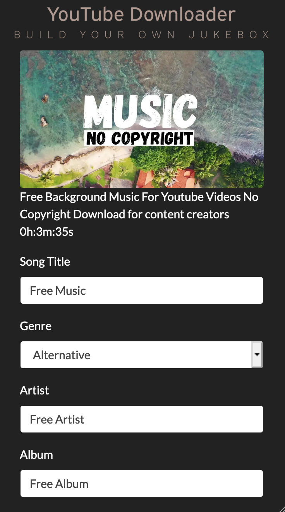
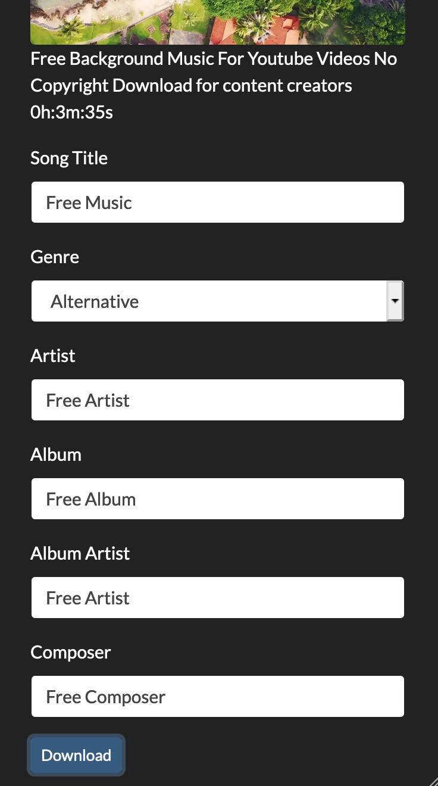

### Installation

1. `git clone <this repo>`
1. Create a virtual environment.
1. Have `ffmpeg` installed.
1. If you want to host this on a Raspberry Pi, then [follow these instructions](https://www.techcoil.com/blog/how-to-setup-python-imaging-library-pillow-on-raspbian-stretch-lite-for-processing-images-on-your-raspberry-pi/) to install the `pillow` package dependencies.
1. `pip install -r requirements.txt`

### Running in Development
1. `export FLASK_APP=app.py`
1. `flask run`
1. Launch `http://127.0.0.1:5000/`

### Running with Gunicorn (local)
`gunicorn -b 0.0.0.0:4400 -w=4 app:app`

### Running with Gunicorn behind Nginx

https://www.e-tinkers.com/2018/08/how-to-properly-host-flask-application-with-nginx-and-guincorn/

### User Guide

  
   
  
  

